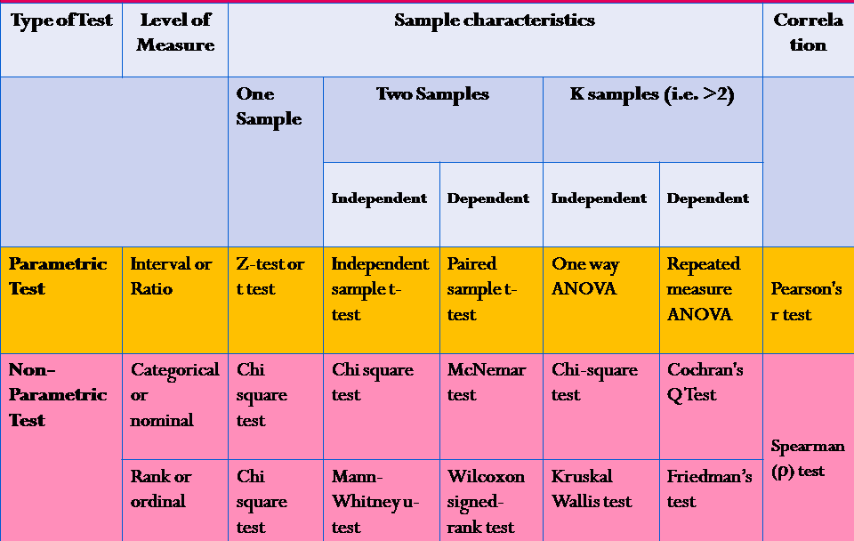
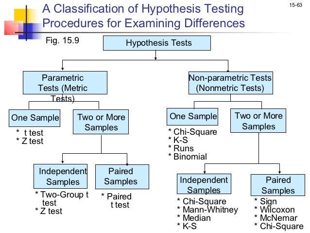

# Marketing strategy optimization a/b testing (parametric and non-parametric)

[](https://www.python.org/)  
[](LICENSE)  
[](https://github.com/your_username/clustering_project/stargazers)

---

## 🎯 Business Challenge

The business problem addressed is identifying which marketing contact strategies most effectively drive customer subscriptions. By simulating a real-world A/B test, the analysis compares contacted (treatment) vs. non-contacted (control) users to measure conversion impact. The goal is to determine if outreach works, which methods perform best, and where to focus future marketing efforts.


## What tests included (paarametric and non parametric)?

This project compares marketing strategies using A/B testing. It applies ANOVA, Welch’s t-test, Tukey’s HSD, Chi-square, Z-tests, Bayesian tests, Kruskal–Wallis, Fisher’s Exact Test  and Mann–Whitney U. Visual and diagnostic checks ensure robustness. Insights guide which strategies to scale or drop based on conversion impact.

## Why both parametric and non paara mterictests inlcudded tests?
Both parametric and non-parametric tests are included to ensure reliable results under varying data conditions. When assumptions like normality or equal variance don’t hold, non-parametric tests provide robust alternatives, ensuring insights remain valid and actionable.


## tests vs makrteing strategy problem
| Assumption Type               | Comparison Type                         | Comparison Goal                          | Statistical Test(s)                               |
|------------------------------|-----------------------------------------|------------------------------------------|---------------------------------------------------|
| Parametric (Valid)           | Treatment vs Control                    | Overall Impact                           | Chi-square Test                                   |
| Parametric (Valid)           | Control vs Treatment                    | Significant Difference                   | Bayesian Test                                     |
| Parametric (Valid)           | Strategy vs Strategy                    | Best Strategy                            | Z-test (Pairwise Proportions)                     |
| Non-Parametric               | Treatment vs Control                    | Overall Impact                           | Fisher’s Exact Test                               |
| Non-Parametric               | Control vs Treatment                    | Significant Difference                   | Kruskal–Wallis Test                               |
| Non-Parametric               | Strategy vs Strategy                    | Best Strategy                            | Mann–Whitney U Test                               |
| Parametric (Partially Valid) | Treatment vs Control                    | Binary Outcome Comparison                | Chi-square Test                                   |
| Parametric (Partially Valid) | Control vs Treatment                    | Group Differences                        | One-Way ANOVA, Welch’s t-test (Pairwise)          |
| Parametric (Partially Valid) | Strategy vs Strategy                    | Post-hoc Comparison                      | Tukey’s HSD Test  

---
## Parametric and non parametric Tests
<p float="left">
  
  
</p>                        |

---

## a/b test findings

| **Test**                | **H₀**                                           | **H₁**                                           | **Key Findings**                                                                                           |
|-------------------------|--------------------------------------------------|--------------------------------------------------|-------------------------------------------------------------------------------------------------------------|
| **Chi-Square Test**     | Success rates are equal (T vs C)                | Success rates differ (T vs C)                   | 9 of 10 strategies show lift (p < 0.001); “Welcome Calls” leads, “Cellular” performs worst                  |
| **Bayesian A/B Test**   | All strategies have equal true rates            | At least one strategy has a different true rate | Welcome Calls P(best) ≈ 0.744; Festive Offers ≈ 0.253; others ≈ 0                                          |
| **Pairwise Z-Test**     | Proportions are equal (pᵢ = pⱼ)                 | Proportions differ (pᵢ ≠ pⱼ)                    | Most p < 0.001; Welcome Calls leads; Cellular and Telephone underperform                                   |
| **Fisher’s Exact Test** | T and C have equal success rates                | Success rates differ between T and C            | p = 0.0000; odds ratio = 2.42 → Treatment converts significantly better                                     |
| **Kruskal–Wallis Test** | All strategies have same distribution           | At least one differs                            | p = 0.0000; significant distribution difference detected                                                    |
| **Mann–Whitney U Test** | Strategy i = Strategy j in distribution         | One strategy > the other                        | Welcome Calls wins 8/10 tests; Festive Offers, Voice Blasts strong; Cellular weak                          |
| **One-Way ANOVA**       | All means are equal across strategies           | At least one mean differs                       | Welcome Calls (74.4%) and Festive Offers (25.3%) dominate probability of best                              |
| **Pairwise t-Tests**    | Meanᵢ = Meanⱼ                                   | Meanᵢ ≠ Meanⱼ                                   | Most p ≪ 0.001; strong pairwise differences; top strategies consistently outperform others                  |
| **Tukey’s HSD**         | All strategy means equal                        | At least one pair differs                       | Welcome Calls > all others; Festive Offers next best (p-adj ≈ 0.51)                                         |

## Final results
| **Insight**                  | **Summary**                                                                                                                       |
|-----------------------------|------------------------------------------------------------------------------------------------------------------------------------|
| **Treatment Effect Proven** | 100% of relevant tests (Chi-square, Fisher’s, Z-test, logistic models) show treatment outperforms control — marketing is effective. |
| **Strategies Differ**       | All strategy comparison tests (ANOVA, Kruskal–Wallis, Tukey HSD, Mann–Whitney U, Z-test) reveal significant differences.            |
| **Welcome Calls Dominate**  | In all model rankings and pairwise tests, Welcome Calls is the top-performing strategy with highest success rate and consistency.   |

Here’s your **A/B Testing Project Pipeline** rewritten in a compact, phase-wise format, similar in tone and style to the neural network version:

---

##  A/B Testing Project Pipeline

1. **Business Understanding**
   Define marketing goals: measure strategy impact on subscriptions, identify top performing outreach methods.

2. **Data Wrangling**
   Load and clean campaign logs, define treatment/control groups using `poutcome`, resolve nulls, encode labels.

3. **Preprocessing**
   Binary encode outcomes, format dates, validate group assignments, drop irrelevant or leak prone columns.

4. **Exploratory Data Analysis**
   Plot conversion rates, strategy distributions, group sizes, inspect for imbalance or noise.

5. **Diagnostic Tests**
   Assess normality, variance homogeneity, independence, identify assumption violations before selecting test type.

6. **A/B Tests – Parametric (Valid)**
   Run Chi-square, Z-tests, Bayesian A/B tests where assumptions (normality, equal variance) are met.

7. **A/B Tests – Non-Parametric (No Assumptions)**
   Apply Fisher’s Exact, Kruskal–Wallis, Mann–Whitney U when assumptions are violated or data is categorical.

8. **A/B Tests – Parametric (Partially Valid)**
   Use One-Way ANOVA, Welch’s t-tests, Tukey HSD relying on large-N robustness (CLT) under partial assumption validity.

9. **Findings & Summary**
   Treatment effect confirmed, strategies differ significantly, Welcome Calls consistently top performer across all tests.

10. **Future Scope**
    Extend to time-based A/B tests, add cost-per-conversion analysis, integrate uplift modeling for causal targeting.


---

## 🔧 Installation & Quick Start

**1. Clone the repo**

```bash
git clone https://github.com/SindhePandurangBITS/ab-testing-project.git
cd ab-testing-project
```

**2. Create & activate virtual environment**

```bash
python3 -m venv venv
source venv/bin/activate
```

**3. Install dependencies**

```bash
pip install -r requirements.txt
```

**4. Run full pipeline**

```bash
#Load and structure data
python src/data_loader.py \
  --input data_raw/ab_data.csv \
  --output data_processed/clean.csv

#Preprocessing
python src/preprocessing.py \
  --input data_processed/clean.csv \
  --output data_processed/preprocessed.csv

#Perform EDA
python src/EDA.py \
  --input data_processed/preprocessed.csv

#Run diagnostics
python src/diagnostics.py \
  --input data_processed/preprocessed.csv

#Run parametric tests (assumptions valid)
python src/tests_parametric(valid).py \
  --input data_processed/preprocessed.csv

#Run parametric tests (assumptions partially valid)
python src/tests_parametric(partially_valid).py \
  --input data_processed/preprocessed.csv

#Run non-parametric tests
python src/tests_nonparametric.py \
  --input data_processed/preprocessed.csv
```
---

## 📖 Documentation & Notebooks
Detailed analyses live in notebooks:
- **notebooks\AB_testing(para_and_non_parametric)**
* **Goal to Insight:** Defined marketing impact goals, identified treatment/control groups; confirmed strategy effectiveness through statistical testing.
* **Full Pipeline:** Cleaned data, encoded outcomes, ran diagnostics, applied parametric and non-parametric A/B tests based on assumption validity.
* **Key Outcomes:** Found strong treatment effect, Welcome Calls emerged as top strategy, future work includes time-based testing and uplift modeling.

---
⭐ Support
If this project helped you, please ⭐ star the repository and share!

---

##  Key References

1. **Kohavi, R., Longbotham, R., Sommerfield, D., & Henne, R. (2009)**  
   *Controlled Experiments on the Web: Survey and Practical Guide*  
   _Data Mining and Knowledge Discovery, 18(1), 140–181_  
   [https://doi.org/10.1007/s10618-008-0114-1](https://doi.org/10.1007/s10618-008-0114-1)  
  

2. **NASSCOM & Zinnov (2020)**  
   *Marketing Analytics in India – Unlocking the Power of Data*  
   [https://nasscom.in/knowledge-center/publications/marketing-analytics-india-unlocking-power-data](https://nasscom.in/knowledge-center/publications/marketing-analytics-india-unlocking-power-data)  
